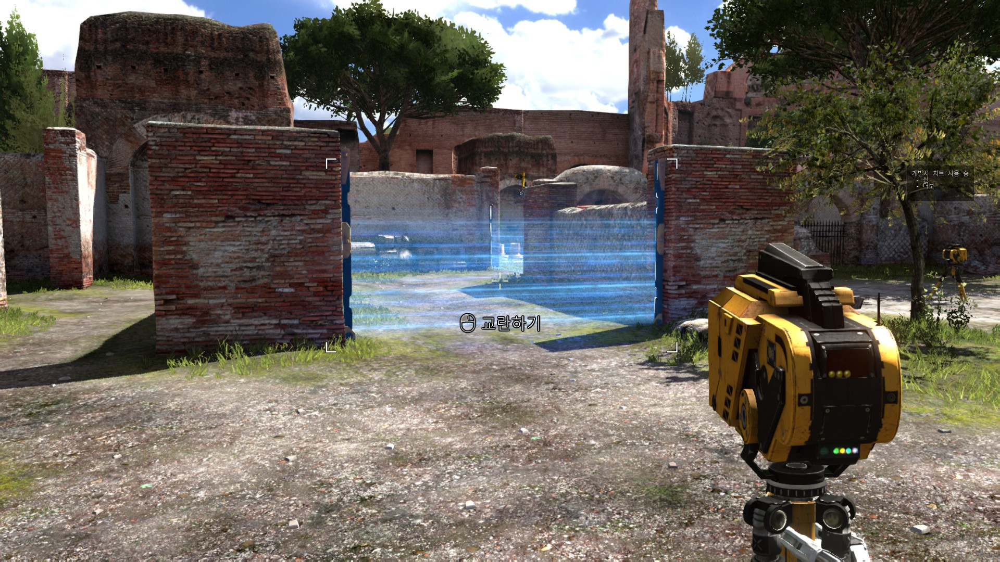
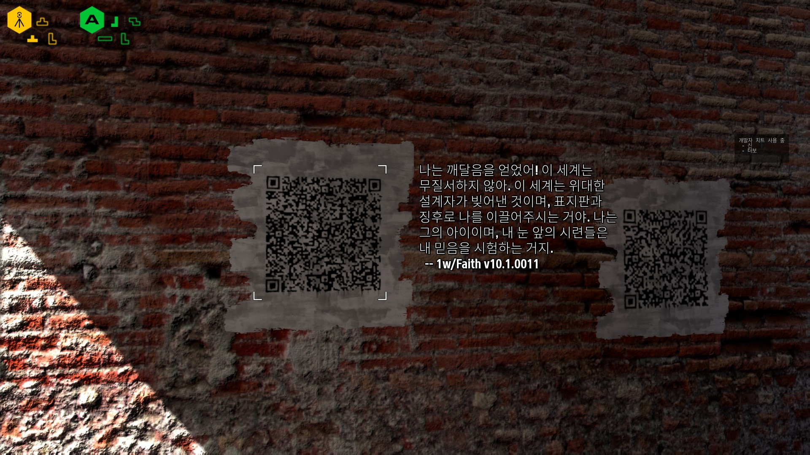
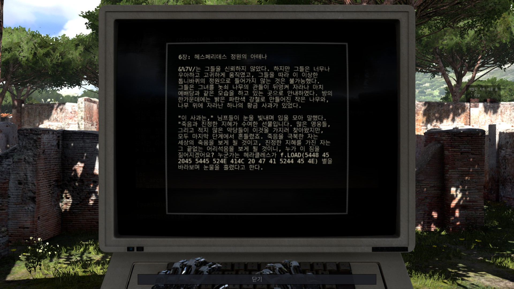
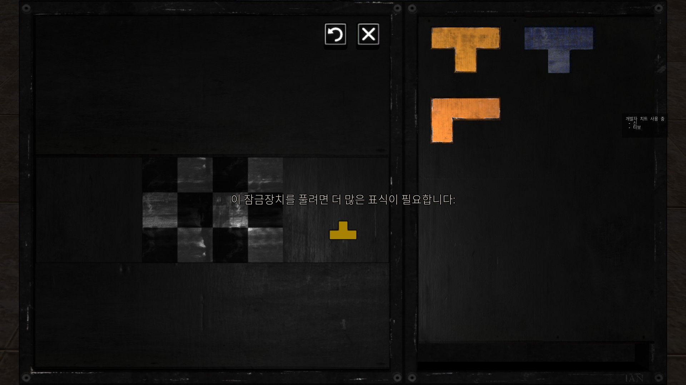
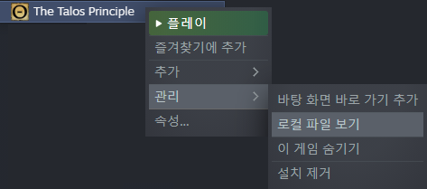
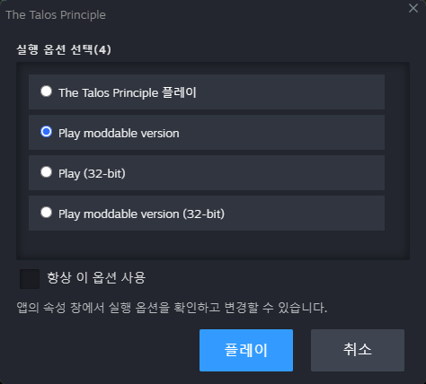
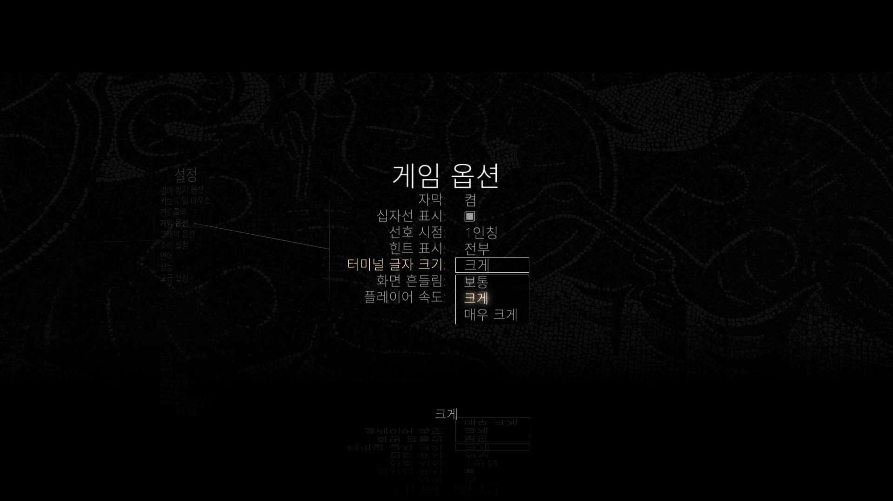

# 시누의 The Talos Principle 재한글화 프로젝트

[English](README_en.md)

최근에 The Talos Principle 게임을 플레이해보고 큰 감명을 받았는데, 받은 감명만큼이나 처참한 한국어 번역 상태를 눈 뜨고 봐줄 수가 없어서 영문 텍스트를 베이스로 직접 제작한 한국어 재번역 모드입니다.

최신 버전의 Steam판에서만 정상 작동을 보증하며, 다른 플랫폼/스토어 버전에는 적용할 수는 있겠으나 정상 작동을 보증하지 않습니다.

# 설치 방법

1\) [여기](https://github.com/sinusinu/TalosRetranslationKR/releases)에서 `talos_kr.gro` 파일을 다운로드합니다.

2\) 게임이 설치된 경로로 들어갑니다. 잘 모르겠다면, Steam 라이브러리의 게임 목록에서 `The Talos Principle` 우클릭 → `관리` → `로컬 파일 보기`를 통해 들어갈 수 있습니다.

3\) `게임 설치 경로\Content\Talos` 폴더 안에 1에서 다운받은 `talos_kr.gro` 파일을 배치합니다.

4\) Steam에서 `The Talos Principle`을 실행할 때, `Play moddable version`을 선택하여 실행합니다.

5\) (선택사항) 한글 폰트가 얇아 터미널에서 글자가 잘 보이지 않으니, `설정` → `게임 옵션` → `터미널 글자 크기`를 `크게` 이상으로 설정하는 것을 권장합니다.

# 번역 상황

| 대상 | 진행도 |
| --- | --- |
| 인터페이스 | 100%?1) |
| 퍼즐 이름 및 힌트 | 100% |
| QR 코드 | 100%2) |
| MLA | 100% | 
| 아카이브 | 100%2) |
| 음성 및 자막 | 기존 번역 사용3) |

1\) 일반적인 PC 환경에서 부가 장치 없이 사용할 경우 나타나는 텍스트는 모두 번역되었습니다. 모바일/VR 등의 특수 환경에서는 번역되지 않은 텍스트가 있을 수 있습니다.

2\) UTF-8로 한글을 쓰면 바이트 수가 너무 늘어나버리는지라 바이너리 데이터는 따로 번역하지 않았습니다.

3\) 한국어 더빙이 주는 직관과 몰입이 있어 기존 번역을 그대로 사용했지만, 그나마 나은 축에 속하는 음성 대사 번역 역시 품질이 그렇게 좋지는 않습니다. 특히 엘로힘 대사 몇 개는 대사 대신 <s>피카츄마냥</s> "엘로힘."이라고만 말하는 부분이 몇 군데 있어 그 부분은 영문 음성으로 교체되도록 해놓았습니다.

# 향후 계획

- 음성 전부 영어로 변경 후 자막까지 재번역

- Road to Gehenna 번역

# 권리

재사용된 기존 한국어 번역 텍스트를 제외한 새로운 번역 텍스트의 유일한 작업자인 저(sinusinu)는 제 번역 작업물에 대한 모든 권리를 포기합니다. 제 작업물은 퍼블릭 도메인으로 배포되며, 제 작업물에 한해서는 얼마든지 자유롭게 사용하실 수 있습니다.
