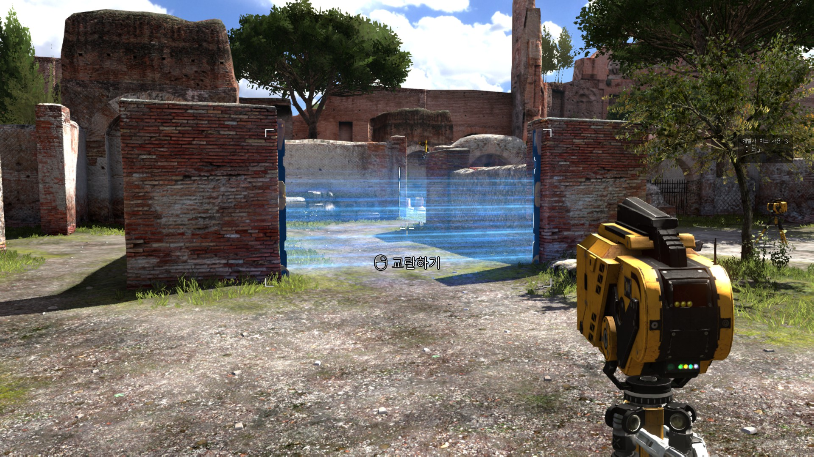
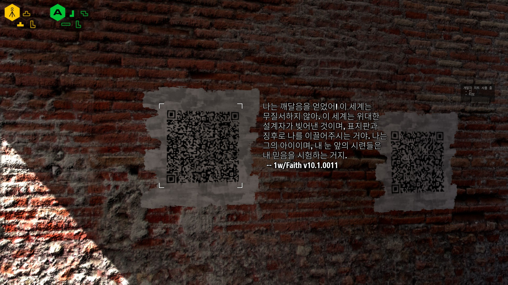
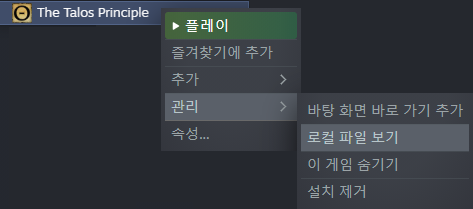
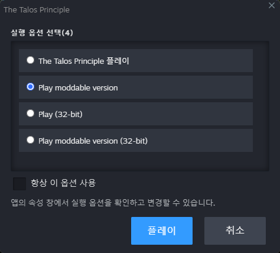

# sinusinu's Korean Retranslation Project of The Talos Principle

I recently played The Talos Principle and fell in love with it, but its Korean translation was downright horrible and made the game utterly unplayable. I made this mod to fix that. This mod is based on the English text of the game, and completely retranslated from ground up.

Tested and working on latest version on Steam. Other platform/store versions might work but I give no guarantee.

# How to Install

1\) Click [here](https://github.com/sinusinu/TalosRetranslationKR/releases) to download the `talos_kr.gro` file.

2\) Navigate to the game folder. If you don't know how, Right click `The Talos Principle` from Steam Library game list → `Manage` → `Browse Local Files`.

3\) Place the `talos_kr.gro` file into the directory `(game folder)\Content\Talos`.

4\) Launch `The Talos Principle` from Steam, and select `Play moddable version`.

5\) (Optional) Since Korean font is a bit too thin, it could be hard to read texts from terminal. It is recommended to set `Settings` → `Game Options` → `Terminal font size` to at least `Large`.

# Current Progress

| Main Game | Progress |
| --- | --- |
| User Interface | 100%?1) |
| Puzzle names and Hints | 100% |
| QR code messages | 100%2), proofreading |
| MLA | 100%, proofreading |
| Archives | 100%2), proofreading |
| Voiceover and Subtitles | Using existing translation3) |

| RtG | Progress |
| --- | --- |
| Draft (Private) | 38% |

1\) All texts that appear on normal PC environment without no extra peripherals are translated. Other environments like Mobile/VR might have some untranslated texts.

2\) Binary data is not translated due to UTF-8 requiring 3 bytes per each Korean glyph. It bloated texts too much.

3\) Due to the intuitive immersion that Korean dub provides, and it being the part that has the most of the "acceptable" translation, I decided to reuse existing translation for Voiceover and Subtitles as is. But, its translation quality is still subpar. In some voiceovers, Elohim just says "Elohim." instead of the line he is supposed to read, so that is replaced with matching English voiceover.

# Future Plans

- Proofread translated texts
- Translate Road to Gehenna DLC
- Replace Korean voiceover with English one and retranslate Subtitles

# About Rights

Beside reused existing translations, I (sinusinu) am the sole translator of this project. As a sole translator of this project, I hereby declare that I give up all the rights I might have on my translation works of this project. This translation works are distributed as a public domain work.
